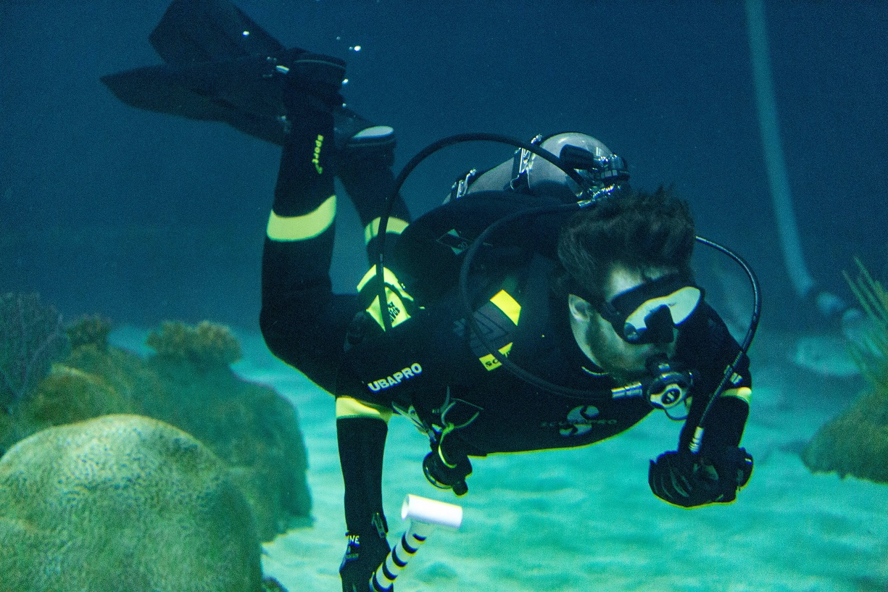

# A little insight into Ryne Smith
Hello. This README serves as a quick way to get to know a little bit about me.

## My Career Passions
Some constants that have been true since I was a kid are my affinity for science & tech, learning, and solving problems. Specifically, I love working on a complex problem and finally reachong one of those "Eureka!" moments. I live for those! This is especially exciting for me if the tech is helping explore the unknown or pushing some limit.

## My Hobbies
I'm an avid reader of books. This year I have finished the Chronicles of Narnia series, The Hobbit, and started Dune. I also like to read and watch courses on a myriad of subjects (too many for my own good probably!). At this time, these include a book on concurrency in Python, a book on the development of mathematics, and an introductory course on linguistics. :books:
